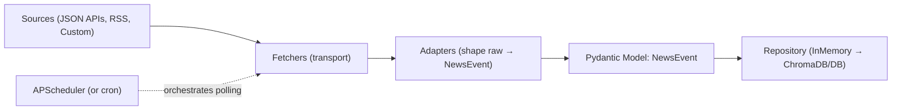

```yaml
---
title: "Design Patterns for quickly building Reliable Data Pipelines with AI"
date: 2025-08-14
tags: ["data-pipeline", "python", "pydantic", "adapters", "repository", "apscheduler"]
description: "A small set of patterns—data contracts, adapters/fetchers, repositories—lets you grow from a single script to a reliable, testable pipeline with minimal rewrites."
draft: false
---
```

## Why small pipelines get messy fast

Fetching multiple sources (JSON APIs, RSS, custom endpoints) often starts as glue scripts. Then reality hits:
- Adding a new source touches too much code
- Data shapes differ wildly
- Storage changes are painful
- Scheduling/observability are afterthoughts

This post shows a compact architecture that stays flexible as you add sources or swap storage:
- A contract-first Pydantic model to standardize data
- Clear separation between transport (fetchers) and transformation (adapters)
- A repository interface so storage is swappable (start in-memory, go persistent later)
- Config-driven sources and light scheduling with APScheduler

Code and structure are based on my project [Newsfeed Platform](https://github.com/fxd24/newsfeed_platform).

## The contract: one Pydantic model

Your pipeline needs a single language. Here that’s `NewsEvent` in `src/models/domain.py`. Everything coming in is shaped into this model; everything stored or served flows through it.

```python
# src/models/domain.py (excerpt)
from pydantic import BaseModel, ConfigDict, field_serializer
from datetime import datetime
from enum import Enum
from typing import Optional, List, Dict

class NewsType(str, Enum):
    SERVICE_STATUS = "service_status"
    SECURITY_ADVISORY = "security_advisory"
    SOFTWARE_BUG = "software_bug"
    UNKNOWN = "unknown"

class NewsEvent(BaseModel):
    model_config = ConfigDict()
    id: str
    source: str
    title: str
    body: str = ""
    published_at: datetime
    status: Optional[str] = None
    impact_level: Optional[str] = None
    news_type: Optional[NewsType] = NewsType.UNKNOWN
    url: Optional[str] = None
    affected_components: Optional[List[str]] = None

    @field_serializer("published_at")
    def serialize_published_at(self, value: datetime) -> str:
        return value.isoformat()
```

Why this helps:
- Validation at the boundary avoids corrupt data
- Named fields make tests and mapping explicit
- Enables consistent storage and API payloads

## Split responsibilities: fetchers vs adapters

- Fetchers handle transport (HTTP JSON, RSS, special APIs).
- Adapters transform raw payloads into the `NewsEvent` model.
- `UniversalNewsSource` orchestrates them per source.

Interfaces live in `src/sources/__init__.py`:

```python
# src/sources/__init__.py (excerpt)
from typing import Protocol, Any
from abc import ABC, abstractmethod

class DataFetcher(Protocol):
    async def fetch(self, url: str, **kwargs) -> Any: ...

class SourceAdapter(ABC):
    @abstractmethod
    def adapt(self, raw: Any) -> list["NewsEvent"]: ...
```

Concrete implementations are small and focused:
- Fetchers: `src/sources/fetchers.py` (`JSONAPIFetcher`, `RSSFetcher`, `HackerNewsFetcher`)
- Adapters: `src/sources/adapters.py` (`GitHubStatusAdapter`, `RSSAdapter`, etc.)

Minimal example of a fetcher + adapter pair:

```python
# Minimal fetcher (shape mirrors JSONAPIFetcher)
import aiohttp
class JSONAPIFetcher:
    async def fetch(self, url: str, **kwargs) -> dict:
        async with aiohttp.ClientSession() as s:
            async with s.get(url, headers=kwargs.get("headers")) as r:
                r.raise_for_status()
                return await r.json()

# Minimal adapter (shape mirrors RSSAdapter/GitHubStatusAdapter)
from src.models.domain import NewsEvent, NewsType
from datetime import datetime
class SimpleStatusAdapter:
    def adapt(self, raw: dict) -> list[NewsEvent]:
        events: list[NewsEvent] = []
        for item in raw.get("incidents", []):
            events.append(
                NewsEvent(
                    id=item["id"],
                    source="example_status",
                    title=item["name"],
                    body=item.get("body", ""),
                    published_at=datetime.fromisoformat(item["created_at"].replace("Z", "+00:00")),
                    news_type=NewsType.SERVICE_STATUS,
                    url=item.get("url"),
                )
            )
        return events
```

Now wire them up with `UniversalNewsSource`:

```python
# Orchestrate one source
from src.sources import SourceConfig, UniversalNewsSource
config = SourceConfig(
    name="example_status",
    source_type="json_api",
    adapter_class="SimpleStatusAdapter",
    url="https://status.example.com/api/v2/incidents.json",
)

source = UniversalNewsSource(config, JSONAPIFetcher(), SimpleStatusAdapter())
events = await source.get_events()
```

In the project, this wiring is automated with registries in `src/sources/factory.py` so new sources are added via config.

## Repositories: start in-memory, swap later

The repository interface in `src/repositories/news_event_repository.py` lets you switch storage without touching ingestion code.

```python
# src/repositories/news_event_repository.py (excerpt)
from abc import ABC, abstractmethod
from typing import Optional
from src.models.domain import NewsEvent

class NewsEventRepository(ABC):
    @abstractmethod
    def create_events(self, events: list[NewsEvent]) -> None: ...
    @abstractmethod
    def get_all_events(self) -> list[NewsEvent]: ...
    @abstractmethod
    def get_event_by_id(self, event_id: str) -> Optional[NewsEvent]: ...
    @abstractmethod
    def delete_all_events(self) -> None: ...
```

A tiny in-memory implementation enables fast iteration and testing:

```python
# src/repositories/news_event_repository.py (excerpt)
class InMemoryNewsEventRepository(NewsEventRepository):
    def __init__(self):
        self._events: list[NewsEvent] = []
        self._events_by_id: dict[str, NewsEvent] = {}

    def create_events(self, events: list[NewsEvent]) -> None:
        for event in events:
            if event.id not in self._events_by_id:  # idempotent upsert by id
                self._events.append(event)
                self._events_by_id[event.id] = event

    def get_all_events(self) -> list[NewsEvent]:
        return self._events.copy()
```

Swap in a persistent store later (e.g., the provided `ChromaDBNewsEventRepository`) with the same API. Your ingestion service doesn’t change.

```python
# Pseudocode: toggling repositories by config/env
if STORAGE_TYPE == "chromadb":
    repository = ChromaDBNewsEventRepository(persist_directory="./data/chromadb")
else:
    repository = InMemoryNewsEventRepository()
```

Why this pays off:
- Faster feedback loops early on
- Idempotency at the repo boundary reduces duplication bugs
- Storage migrations become configuration changes

## Config-driven sources

Avoid hardcoding sources. Put them in YAML and load at startup (`config/sources.yaml`, `src/config/config_manager.py`):

```yaml
# config/sources.yaml (excerpt)
global:
  default_poll_interval: 300

sources:
  github_status:
    enabled: true
    poll_interval: 300
    source_type: "json_api"
    adapter_class: "GitHubStatusAdapter"
    url: "https://www.githubstatus.com/api/v2/incidents.json"

  techcrunch_rss:
    enabled: true
    poll_interval: 900
    source_type: "rss"
    adapter_class: "RSSAdapter"
    url: "https://techcrunch.com/feed/"
```

The factory in `src/sources/factory.py` reads this and instantiates the right fetcher/adapter for each source.

## Scheduling: cron vs APScheduler (quick guide)

- Use cron when:
  - Scripts are truly stateless
  - You want OS-level scheduling and external observability
  - You don’t need dynamic jobs or in-process coordination

- Use APScheduler when:
  - You need dynamic, in-app scheduling
  - You want controlled concurrency and misfire handling
  - You prefer app-integrated logs/metrics and easier testing

This project uses `AsyncIOScheduler` with interval triggers in `src/scheduler/scheduler_manager.py`:

```python
# src/scheduler/scheduler_manager.py (excerpt)
from apscheduler.schedulers.asyncio import AsyncIOScheduler
from apscheduler.triggers.interval import IntervalTrigger

self.scheduler = AsyncIOScheduler(timezone="UTC")
job = self.scheduler.add_job(
    poll_source,  # async fn that fetches, adapts, and stores events for one source
    trigger=IntervalTrigger(seconds=poll_interval),
    id=f"poll_{source_name}",
    replace_existing=True,
)
self.scheduler.start()
```

You can still run a single scheduler instance under a system supervisor (pm2/systemd/Docker) and keep cron for other jobs. Choose the simplest tool that gives you safety rails.

## Putting it together



## Testing strategy (brief)

- Adapters: pure transformation tests (input payload → `NewsEvent` list)
- Fetchers: test with fakes/mocked HTTP
- Repositories: ensure identical behavior across `InMemory` and persistent implementations
- Scheduler: integration test with short intervals and idempotent repo

## Checklist: adding a new source

- Define mapping in a new adapter or configure `GenericStatusAdapter`
- Pick or implement a fetcher (JSON/RSS/custom)
- Add an entry in `config/sources.yaml`
- Restart the app; verify events are validated and stored via the repository
- Add a small adapter test

## References

- Code: [fxd24/newsfeed_platform](https://github.com/fxd24/newsfeed_platform)
- Key files: `src/models/domain.py`, `src/sources/__init__.py`, `src/sources/fetchers.py`, `src/sources/adapters.py`, `src/sources/factory.py`, `src/repositories/news_event_repository.py`, `src/scheduler/scheduler_manager.py`, `config/sources.yaml`

