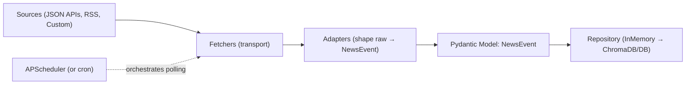

If you’ve ever rushed a prototype and then drowned in refactors, this post is for you. I recently had to ingest a variety of IT news sources—status pages, advisories, product blogs—without prior knowledge of their data shapes. Instead of spelunking each source by hand, I took the architect’s seat and let AI write most of the glue code. A few hours later, I had a reliable, extensible pipeline.

What you’ll learn here:

- How to design a small set of seams that keeps your pipeline clean as it grows
- How to use AI as a code accelerator while you stay in charge of the big picture
- Practical patterns: contract-first model, fetcher/adapter split, repository abstraction, config-driven sources, and scheduler choices
- A repeatable workflow to add a new source fast

I’ll use my `Newsfeed Platform` project as the running example, but the structure applies broadly.

## Why small pipelines get messy fast

Fetching multiple sources (JSON APIs, RSS, custom endpoints) often starts as glue scripts. Then reality hits:

- Adding a new source touches too much code
- Data shapes differ wildly
- Storage changes are painful
- Scheduling/observability are afterthoughts

That’s how duplication creeps in and why “just one more source” becomes a slog. The fix is to commit to a few strong seams up front.

This post shows a compact architecture that stays flexible as you add sources or swap storage:

- A contract-first Pydantic model to standardize data
- Clear separation between transport (fetchers) and transformation (adapters)
- A repository interface so storage is swappable (start in-memory, go persistent later)
- Config-driven sources and light scheduling with APScheduler

Code and structure are based on my project [Newsfeed Platform](https://github.com/fxd24/newsfeed_platform).

## Engineer-as-Architect, AI-as-Copilot

AI is excellent at writing code once you define the boundaries. It’s still weak at holding the whole system in its head and making trade-offs—that’s our job. My flow:

- Clarify the big picture: contracts, seams, idempotency, failure modes
- Ask AI to propose options; decide as an engineer
- Let AI generate focused code that snaps into the architecture (fetchers, adapters, tests)

Tools I used: thought partnership with Claude Desktop App and Gemini; code generation and refactors mainly in Cursor. I’ll try Claude Code next.

## The Data Model: one Pydantic model

Your sources won’t agree on fields. Your system should. Define one canonical contract and make everything conform to it. In this project, that’s `NewsEvent`.

Think of it as the one shape all data must take. Your pipeline needs a single language. Here that’s `NewsEvent` in `src/models/domain.py`. Everything coming in is shaped into this model; everything stored or served flows through it.

```python
# src/models/domain.py (excerpt)
from pydantic import BaseModel, ConfigDict, field_serializer
from datetime import datetime


class NewsEvent(BaseModel):
    model_config = ConfigDict()
    id: str
    source: str
    title: str
    body: str = ""
    published_at: datetime
    ...

    @field_serializer("published_at")
    def serialize_published_at(self, value: datetime) -> str:
        return value.isoformat()
```

Why this helps:

- Validation at the boundary avoids corrupt data
- Named fields make tests and mapping explicit
- Enables consistent storage and API payloads

## Split responsibilities: fetchers vs adapters

Here’s the mental model: fetchers bring data into the house; adapters make it house‑style. Keeping transport separate from transformation is what makes adding sources easy.

- Fetchers handle transport (HTTP JSON, RSS, special APIs).
- Adapters transform raw payloads into the `NewsEvent` model.
- `UniversalNewsSource` orchestrates them per source.

Interfaces live in `src/sources/__init__.py`:

```python
# src/sources/__init__.py (excerpt)
from typing import Protocol, Any
from abc import ABC, abstractmethod

class DataFetcher(Protocol):
    async def fetch(self, url: str, **kwargs) -> Any: ...

class SourceAdapter(ABC):
    @abstractmethod
    def adapt(self, raw: Any) -> list["NewsEvent"]: ...
```

Concrete implementations are small and focused:

- Fetchers: `src/sources/fetchers.py` (`JSONAPIFetcher`, `RSSFetcher`, `HackerNewsFetcher`)
- Adapters: `src/sources/adapters.py` (`GitHubStatusAdapter`, `RSSAdapter`, etc.)

## Repositories: start in-memory, swap later

A repository abstracts storage behind a tiny interface. Start with in-memory for speed; swap to a persistent implementation without touching ingestion code. “In‑memory” simply means data lives in the app’s RAM and disappears on restart. This isperfect for local development and tests. This keeps early iteration fast and later migrations excitingly short.

The repository interface in `src/repositories/news_event_repository.py` lets you switch storage without touching ingestion code.

```python
# src/repositories/news_event_repository.py (excerpt)
from abc import ABC, abstractmethod
from typing import Optional
from src.models.domain import NewsEvent

class NewsEventRepository(ABC):
    @abstractmethod
    def create_events(self, events: list[NewsEvent]) -> None: ...
    @abstractmethod
    def get_all_events(self) -> list[NewsEvent]: ...
    @abstractmethod
    def get_event_by_id(self, event_id: str) -> Optional[NewsEvent]: ...
    @abstractmethod
    def delete_all_events(self) -> None: ...
```

A tiny in-memory implementation enables fast iteration and testing:

```python
# src/repositories/news_event_repository.py (excerpt)
class InMemoryNewsEventRepository(NewsEventRepository):
    def __init__(self):
        self._events: list[NewsEvent] = []
        self._events_by_id: dict[str, NewsEvent] = {}

    def create_events(self, events: list[NewsEvent]) -> None:
        for event in events:
            if event.id not in self._events_by_id:  # idempotent upsert by id
                self._events.append(event)
                self._events_by_id[event.id] = event

    def get_all_events(self) -> list[NewsEvent]:
        return self._events.copy()
    
    ...
```

Swap in a persistent store later (e.g., the provided `ChromaDBNewsEventRepository`) with the same API. Your ingestion service doesn’t change.

```python
# Pseudocode: toggling repositories by config/env
if STORAGE_TYPE == "chromadb":
    repository = ChromaDBNewsEventRepository(persist_directory="./data/chromadb")
else:
    repository = InMemoryNewsEventRepository()
```

Why this pays off:

- Faster feedback loops early on
- Idempotency at the repo boundary reduces duplication bugs
- Storage migrations become configuration changes

## Config-driven sources

Avoid hardcoding sources. Put them in YAML and load at startup (`config/sources.yaml`):

```yaml
# config/sources.yaml (excerpt)
global:
  default_poll_interval: 300

sources:
  github_status:
    enabled: true
    poll_interval: 300
    source_type: "json_api"
    adapter_class: "GitHubStatusAdapter"
    url: "https://www.githubstatus.com/api/v2/incidents.json"

  techcrunch_rss:
    enabled: true
    poll_interval: 900
    source_type: "rss"
    adapter_class: "RSSAdapter"
    url: "https://techcrunch.com/feed/"
```

The factory in `src/sources/factory.py` reads this and instantiates the right fetcher/adapter for each source.

## Scheduling: cron vs APScheduler (quick guide)

When should scheduling live outside the app, and when should it live inside? Put it where it's simplest to reason about.

- Use cron when:
  - Scripts are truly stateless
  - You want OS-level scheduling and external observability
  - You don't need dynamic jobs or in-process coordination

- Use APScheduler when:
  - You need dynamic, in-app scheduling
  - You want controlled concurrency and misfire handling
  - You prefer app-integrated logs/metrics and easier testing
  - Different sources have different natural update frequencies
  - Users want personalized polling intervals for specific sources
  
For this project I chose APScheduler to keep polling logic, retries, and job coordination inside the app. It makes local testing trivial and avoids the operational dance of updating cron across environments.

More importantly, APScheduler shines when sources have different rhythms: GitHub status updates every 5 minutes during incidents but hourly otherwise, while TechCrunch RSS might be fine at 15-minute intervals. Users might want breaking news sources polled aggressively but niche blogs checked daily. APScheduler lets you configure per-source intervals in `sources.yaml` and even adjust them dynamically based on user preferences or source behavior patterns—all without touching cron files or redeploying.

## Putting it together



## Testing strategy (brief)

Because responsibilities are cleanly split, tests are straightforward and reliable:

- Adapters: pure transformation tests (input payload → `NewsEvent` list)
- Fetchers: test with fakes/mocked HTTP
- Repositories: ensure identical behavior across `InMemory` and persistent implementations
- Scheduler: integration test with short intervals and idempotent repo

## Checklist: adding a new source

- Ask AI to draft the adapter from a sample payload using the `NewsEvent` contract
- Define mapping in a new adapter
- Pick or implement a fetcher (JSON/RSS/custom)
- Add an entry in `config/sources.yaml`
- Restart the app; verify events are validated and stored via the repository
- Add a small adapter test

## Closing thoughts

When you start as an architect and let AI fill in the seams, you trade days of spelunking for hours of focused building. The result isn’t just speed; it’s a pipeline that stays clean as it grows.

One caution: AI loves to generate more code than you need. Guardrail the scope.

- Keep prompts narrowly scoped to one seam (one adapter, one fetcher, one test)
- Provide the contract and a minimal template; ask for the smallest working diff
- Delete unused scaffolding; keep interfaces tiny so extensions stay simple

Making projects complex is easy. Keeping them simple is the real magic. 

I hope that this post gives you an insight into how to level up your data pipeline with design patterns and AI.

## References

- Code: [fxd24/newsfeed_platform](https://github.com/fxd24/newsfeed_platform)
- Key files: `src/models/domain.py`, `src/sources/__init__.py`, `src/sources/fetchers.py`, `src/sources/adapters.py`, `src/sources/factory.py`, `src/repositories/news_event_repository.py`, `src/scheduler/scheduler_manager.py`, `config/sources.yaml`
